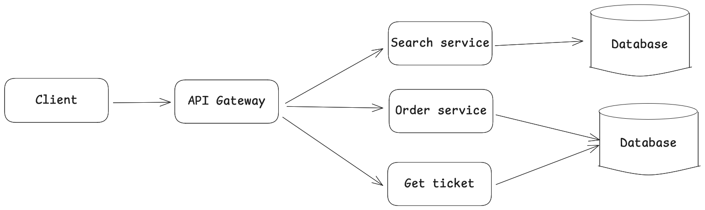

# NBA Booking Ticket
---

### Project goal:
- This ongoing project aims to provide hands-on experience in backend development and DevOps.
- Strengthen my skills across system design, development, and testing, and build a reusable starter kit for future projects.


### Project detail:
- Use data from the (NBA Kaggle)[https://www.kaggle.com/datasets/eoinamoore/historical-nba-data-and-player-box-scores/data?select=LeagueSchedule25_26.csv] dataset to support querying (searching) the NBA 2025–2026 schedule and ticket booking.

### Tools & Skill:
- Golang, gRPC, gRPC-gateway, Postgres, SQL, Postman, RESTful API, Makefile, sqlmock
- Hexgonal code architecture, Miroservices design, Unit testing (Golang).
- Docker, Kubernetes, Prometheus, Loki, Grafana.

### TODO:
- [x] Search Game services
- [x] Deliver starter-kit
- [] Create service image(Dockerfile)
- [] Deployment (Build CI/CD, monitoring, logging)
- [] Booking service(order)
- ...

----

## Docs

### Design
The system starts with a simple architecture in which an API Gateway handles client requests and routes them to individual services, as shown in the architecture diagram.  
The **Search Service** returns NBA games (matches) based on the provided criteria (home team, away team, and game date). These results are queried from a PostgreSQL database.  
The **Order Service** is responsible for booking seats and generating tickets for clients. A **Ticket Service** allows clients to retrieve and view their bookings.  
This architecture is designed to be extensible, and additional modules or services can be added to support the overall ticket-booking workflow.




### Coding
Each service is treated as an independent module, and `go.work` is used to link them together during development. The project follows **hexagonal architecture**, clearly separating application logic, ports, and adapters.  
Inbound and outbound interactions are explicitly organized using the `in/` and `out/` directories within each service.  

For the API Gateway, **gRPC-Gateway** is used to generate RESTful APIs that map to gRPC service stubs. All build and code-generation commands are managed through a `Makefile`.

### Testing
Unit tests are implemented for each component (adapters and ports), along with end-to-end tests across services to validate the complete workflow.


## Development
- **Component**: 
There are data-loader(Inject .csv to database), database(db), and dev-space(development service).

- Dataset Preparation
```
# Working directory
cd ~/booking-tickets

1. Download dataset and extract .csv files in dir (db/data)
unzip DATSETNAME.zip
```

- Run
```
2. Run docker
docker compose up
```


## Deployment
- Build go packages, Install Jenkins, kube, protmethus, grafrana, loki
